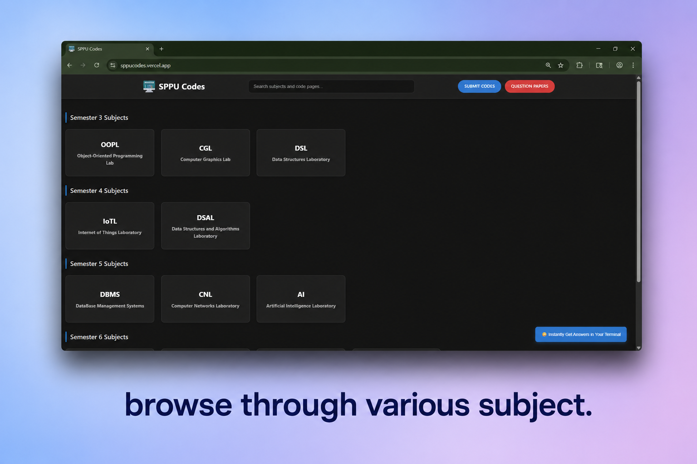
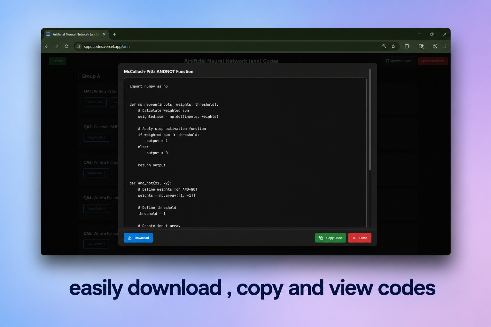
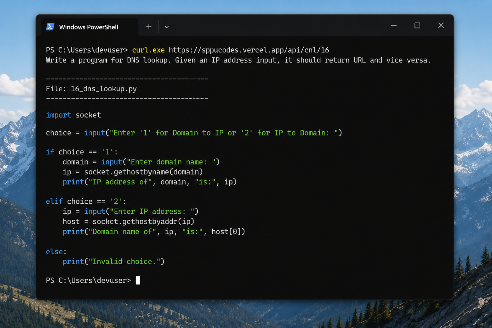
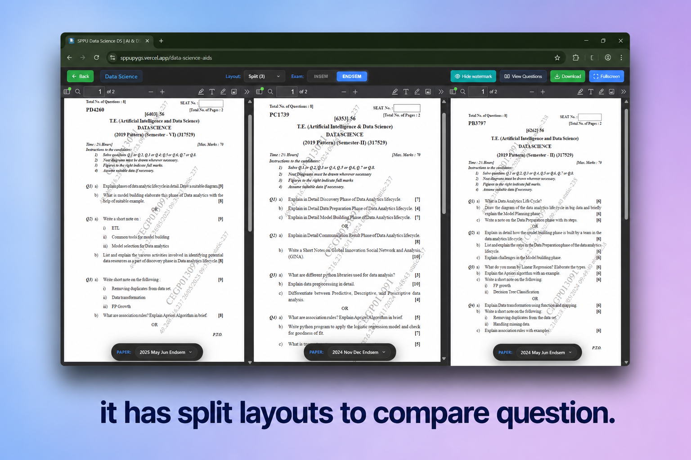
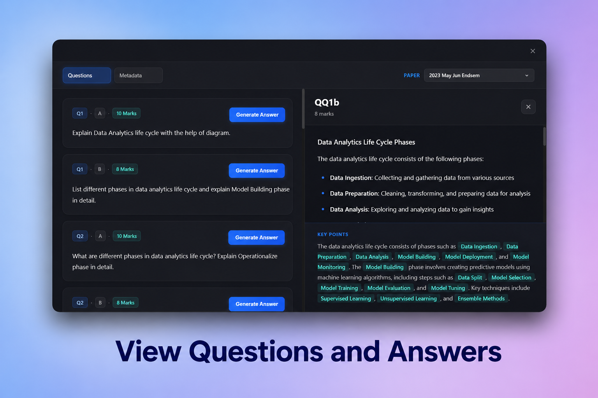
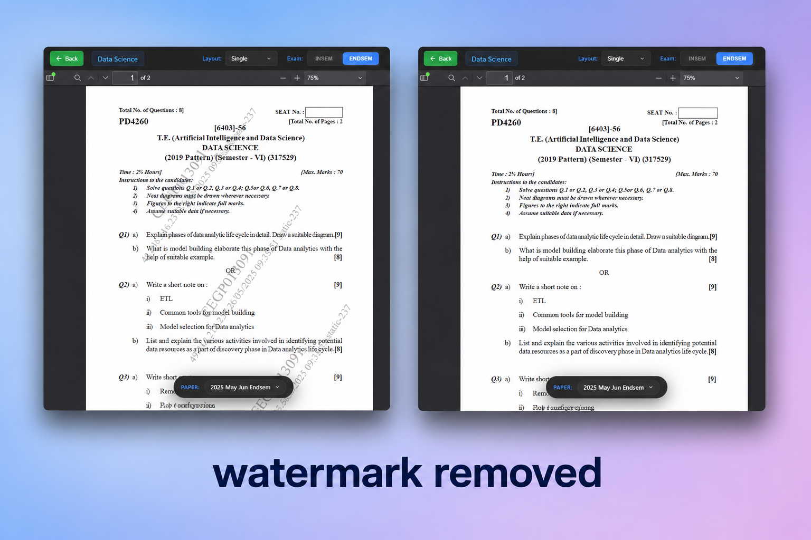

<div align="center">

<br/>

# 🎓 sppu-academics

**Two websites. One repo. Everything an SPPU student needs.**

<br/>

[](https://sppucodes.vercel.app)&nbsp;
[](https://sppupyqs.vercel.app)&nbsp;
[](https://python.org)&nbsp;
[](https://flask.palletsprojects.com)&nbsp;
[](./LICENSE)

<br/>

| | Site | What it does |
|:---:|:---|:---|
| 🖥️ | [**sppucodes.vercel.app**](https://sppucodes.vercel.app) | Lab programs & code solutions for all SPPU subjects |
| 📄 | [**sppupyqs.vercel.app**](https://sppupyqs.vercel.app) | Previous year question papers with exam-prep tools |
| ⚙️ | `shared/` | Worker scripts & utilities shared across both sites |

<br/>

</div>

---

## 📁 Repository Structure

This repo is a monorepo — both sites live here, along with shared utilities that power them both.

```
sppu-academics/
│
├── 📂 sppucodes/       →  Programs & Code Solutions (Flask app)
├── 📂 sppupyqs/        →  Previous Year Question Papers (Flask app)
└── 📂 shared/          →  Shared workers & common utilities
```

> 🔧 The `shared/` folder contains worker logic used across both sites — background jobs, data fetching, and common helpers. See [**worker.md**](./worker.md) for a detailed breakdown.

---

<br/>

## 🖥️ sppucodes — Code & Programs

> 🌐 **[sppucodes.vercel.app](https://sppucodes.vercel.app)** &nbsp;|&nbsp; 📖 [Developer breakdown →](./sppucodes/README.md)

`sppucodes` is a lightweight portal for SPPU lab programs and code solutions. Whether you're stuck on a DSL question at midnight or just want to cross-check your output, this site has you covered — no account, no clutter, no wait.

Browse solutions by subject directly in the browser, or skip the browser entirely and pull code straight into your terminal using the built-in API.

<br/>

**Features**

<table>
<tr>
<td width="50%">

📚 &nbsp;**Subject-wise solutions**
Solutions are organized by subject code so you can jump straight to what you need — no digging through unrelated content.

</td>
<td width="50%">

⚡ &nbsp;**Terminal API**
Fetch any program directly from your command line with a single `curl` command. No browser, no tabs, no fuss.

</td>
</tr>
<tr>
<td>

🔍 &nbsp;**Clean, readable code**
Every solution is formatted for readability — proper indentation, clear structure, and context where it helps.

</td>
<td>

🚪 &nbsp;**Zero friction**
No login. No signup. No paywalls. Open the site and start browsing immediately.

</td>
</tr>
</table>

<br/>

### 🖼️ Screenshots

<p>
  
  &nbsp;
  
</p>

<br/>

### 🚀 Terminal API — Get Code Without Opening a Browser

Why switch to a browser when your terminal is already open? The `sppucodes` API lets you fetch any lab solution with a single command — works on Windows, and prints the output directly in your terminal.

<br/>

**URL format:**

```
https://sppucodes.vercel.app/api/{subject_code}/{question_no}
```

| Placeholder | Description | Examples |
|:---|:---|:---|
| `{subject_code}` | Short name for your subject | `cnl` &nbsp; `dsl` &nbsp; `oopl` |
| `{question_no}` | The question number you want | `1` &nbsp; `16` &nbsp; `22` |

<br/>

**Step-by-step:**

**1️⃣ &nbsp; Open Terminal**

Press the **Windows key**, type **`terminal`**, and press **Enter** to open Windows Terminal.

**2️⃣ &nbsp; Run the command**

Replace `{subject_code}` and `{question_no}` with your values, then run:

```bash
curl.exe https://sppucodes.vercel.app/api/{subject_code}/{question_no}
```

**3️⃣ &nbsp; Your code appears instantly**

The full solution is printed right in your terminal — ready to copy, run, or save.

<br/>

**Example — fetching CNL Question 16:**

```bash
curl.exe https://sppucodes.vercel.app/api/cnl/16
```

> This returns the complete solution for **Computer Networks Lab (CNL)**, Question **16**, directly in your terminal — no browser tab needed.

<br/>

<div align="center">



</div>

<br/>

### ⚙️ Run Locally

Both sites are independent Flask apps. To run `sppucodes` on your machine:

```bash
cd sppucodes
pip install -r requirements.txt
python app.py
```

Then open **[http://localhost:5000](http://localhost:5000)** in your browser.

<br/>

---

<br/>

## 📄 sppupyqs — Previous Year Question Papers

> 🌐 **[sppupyqs.vercel.app](https://sppupyqs.vercel.app)** &nbsp;|&nbsp; 📖 [Developer breakdown →](./sppupyqs/README.md)

`sppupyqs` is a dedicated portal for SPPU previous year question papers. Finding old papers shouldn't be a scavenger hunt — this site organizes everything cleanly, lets you view papers without downloading, and removes the watermarks that make papers hard to read. Whether you're doing a full revision or just checking which questions repeat, it's built to get out of your way and let you focus.

<br/>

**Features**

<table>
<tr>
<td width="50%">

🪟 &nbsp;**Split Layout**
Open two papers side by side in a split view — compare questions across years without juggling tabs or windows.

</td>
<td width="50%">

📥 &nbsp;**Free Downloads**
Every paper is available to download, completely free. No account, no form, no waiting.

</td>
</tr>
<tr>
<td>

🚫 &nbsp;**Watermark Remover**
Papers are served clean — watermarks stripped so you can read and select questions without visual noise getting in the way.

</td>
<td>

👁️ &nbsp;**Direct View**
Read any paper right in the browser without downloading it. Quick reference, zero clutter.

</td>
</tr>
<tr>
<td>

📂 &nbsp;**EndSem / InSem Split**
Papers are clearly separated by exam type — EndSem and InSem — so you're never looking at the wrong set.

</td>
<td>

🏷️ &nbsp;**Smart PDF Naming**
Every file follows a consistent naming format with year and month — no more `paper_final_v2_ACTUAL.pdf` chaos.

</td>
</tr>
</table>

<br/>

### 🖼️ Screenshots



<br/>

<p>
  
  &nbsp;
  
</p>

<br/>

### ⚙️ Run Locally

To run `sppupyqs` on your machine:

```bash
cd sppupyqs
pip install -r requirements.txt
python app.py
```

Then open **[http://localhost:5000](http://localhost:5000)** in your browser.

<br/>

---

<br/>

## 🔧 Workers & Shared Logic

The `shared/` directory is the backbone connecting both sites. It contains background workers, data-fetching utilities, and any logic that would otherwise be duplicated across the two Flask apps. Keeping it in one place means fixes and updates apply everywhere automatically.

📄 See [**worker.md**](./worker.md) for a full breakdown of how the workers are structured, what each one does, and how they're wired into both sites.

<br/>

---

<br/>

## 🤝 Contributing

Found a bug? A question missing? A paper that's wrong?

Feel free to open an issue or submit a pull request. Contributions that improve accuracy, add missing papers, or fix broken solutions are always welcome.

> For code contributions, please check the developer README in the relevant subfolder before making changes — [`sppucodes/README.md`](./sppucodes/README.md) or [`sppupyqs/README.md`](./sppupyqs/README.md).

<br/>

---

<br/>

## 📜 History

`sppucodes` originally handled everything — code solutions **and** question papers — all from a single site. Over time it became clear that these were two distinct tools serving different needs, so they were separated into dedicated sites with their own domains, design, and codebases.

```
sppucodes  (original — served both codes and question papers)
    │
    ├── 🖥️  sppucodes  →  Programs & Code Solutions
    └── 📄  sppupyqs   →  Previous Year Question Papers
```

The split made both sites faster to maintain, easier to improve independently, and cleaner to use.

<br/>

---

<div align="center">

<br/>

Made with ❤️ for SPPU students

<sub>If this saved you time before an exam, consider starring the repo ⭐</sub>

<br/>

[](https://sppucodes.vercel.app)&nbsp;
[](https://sppupyqs.vercel.app)

<br/>

</div>